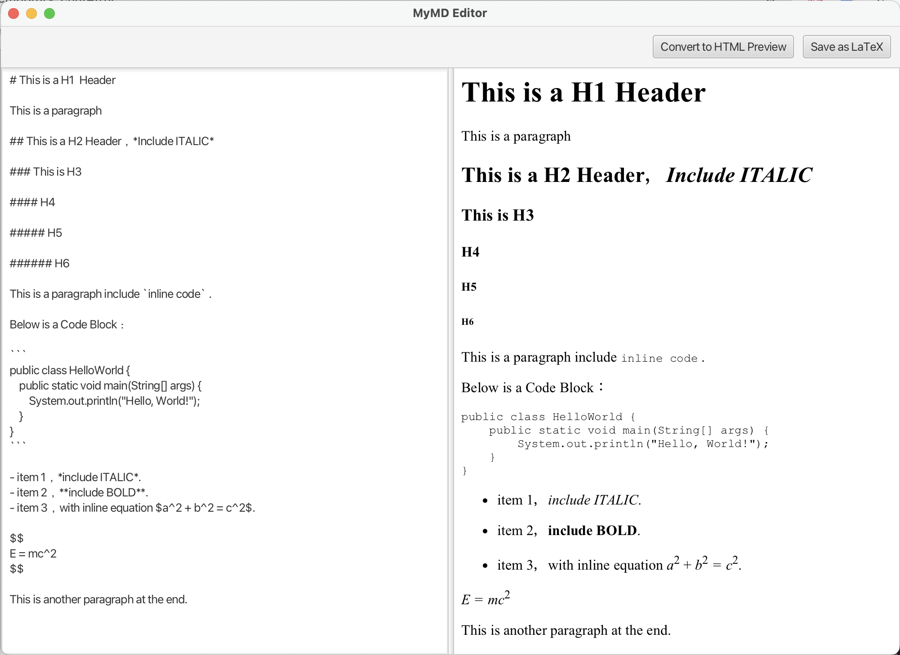

# MyMD: A Custom Markup Editor with Live Preview and LaTeX Export

MyMD is a desktp application built with JavaFX that provides a simple and intuitive editor for a custom markup language. It features a live HTML preview that updates as you type and export documents to high-quality LaTeX files.

This project demonstrates the use of compiler-construction tools like ANTLR for parsing, integration with external command-line tools like Pandoc for document conversion, and desktop GUI development with JavaFX.

## Features

- **Live HTML Preview**: A split-pane view shows your raw markup and the rendered HTML output in real-time.
- **Custom Markup Syntax**: Supports essential formatting features, including:
    - Headers (Levels 1-6)
    - Bold and Italic Text
    - Inline Code and Code Blocks
    - Inline and Display Math Formulas
    - Bulleted Lists
- **LaTeX Export**: Save your work as a `.tex` file, ready for professional academic or scientific typsetting.
- **Extensible Architecture**: By leveraging Pandoc as a backend, the application can be easily extended to support dozens of other export formats (e.g., Docs, PDF, EPUB).



## Technical Overview

The core of MyMD is its two-stage conversion pipeline:
1. **Parsing with ANTLR**: The custom markup input is first processed by an ANTLR-generated parser, which is based on the grammar defined in `MyMD.g4`. This produces a concrete syntax tree.
2. **AST Transformation**: A custom visitor class, `Pandoc AstVisitor`, traverses the syntax tree and builds an Abstract Syntax Tree (AST) that conforms to the Pandoc JSON format.
3. **Conversion with Pandoc**: The generated JSON AST is piped to the Pandoc command-line tool. Pandoc then handles the final conversion to the target format (HTML or LaTeX).

## How to Run

**Prerequisites**:
- JDK 21 or newer
- Apache Maven
- Pandoc (must be installed and available in your system's PATH)

**Instructions**:
1. Clone the repository.
2. Navigate to the project root directory.
3. Run the application using the JavaFX Maven Plugin:
```Bash
mvn clean javafx:run
```

## Testing

Test project utilises JUnit 5 to ensure the quality and correctness of its core logic. Unit tests are focused on the `PandocAstVisitor` class, which handles the critical transformation from the ANTLR parse tree to the Pandoc AST.

The tests verify that various MyMD syntax elements are correctly and reliably parsed into their corresponding AST structures.

### Running the Tests

To run the suite of unit tests, navigate to the project's root directory and execute the following Maven command:
```Bash
mvn clean test
```
